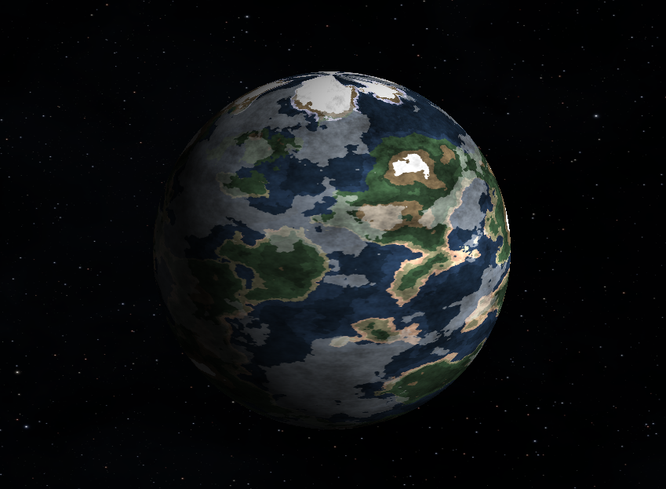
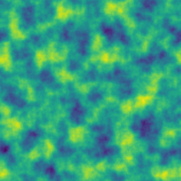
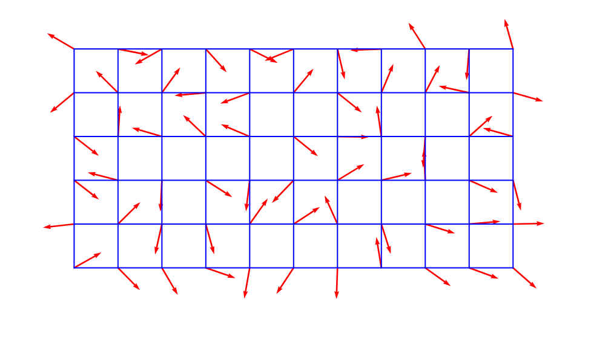
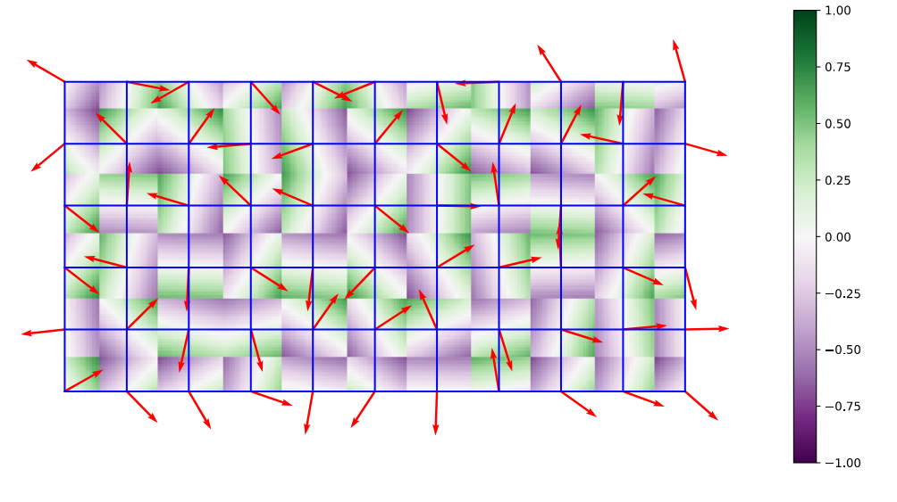
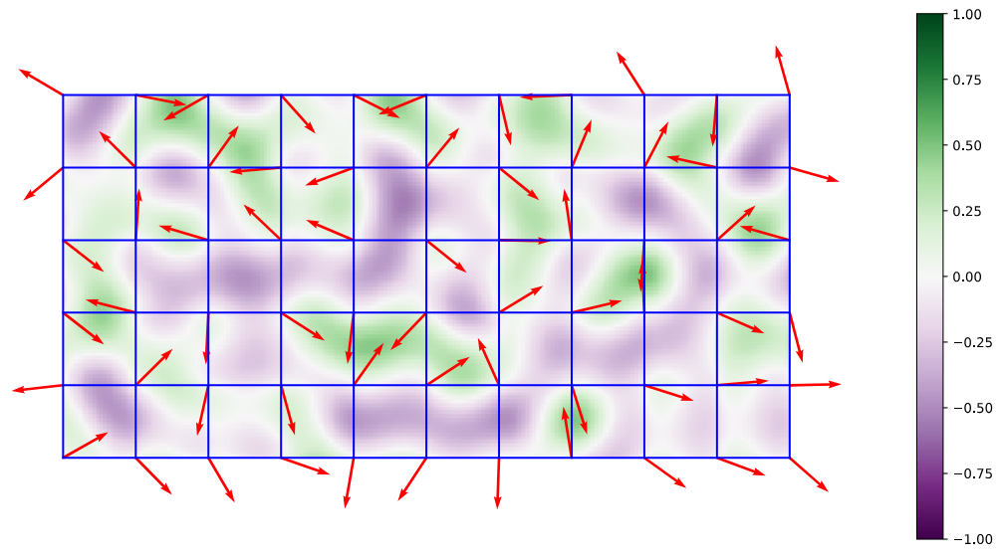

# planetmake

Planet generator using procedural generation.

## Planet generator



This project aims to create earth-type planets based on procedural generation. Texture is first generated with perlin noise and applied to an OpenGL sphere rotating in a pygame window.

## Perlin noise



Perlin noise aims to make a smooth, random looking grid of points where nearby points have similar values.



In the first step, a grid is generated, with a unit gradient vector with a random angle per grid point. So for each cell there are 4 vectors.



To compute the perlin value for any point in a given cell, the offset vector is computed which is the distance vector between the point and a cell vertice. So in a 2D grid, for any point in the cell, there are 4 offset vectors corresponding to the 4 cell corners. Then, for each cell, the dot product between the offset vector and its associated grid corner vector is computed. This measures how much the corner’s gradient “pushes” at point p.



The last step consists in making an interpolation to smooth the values. For any point p inside a cell, there is 4 dot products such as:

- Bottom-left corner (x0,y0): dot product = d00
- Bottom-right corner (x1,y0): dot product = d10
- Top-left corner (x0,y1): dot product = d01
- Top-right corner (x1,y1): dot product = d11

Local coordinates x_local and y_local are computed and passed to a fade function to make transitions between cells smooth and inside the cell (Moving across a cell: noise changes gradually and moving across multiple cells: no visible seams).

```txt
x_local = x - x0
y_local = y - y0

x_faded = fade(x_local)
y_faded = fade(y_local)
```

The value x_faded is interpolated with top and bottom corners (x-axis). Reduce from 4 dot product values to 2.

```txt
i_x0 = interpolation(d00, d10, x_faded)
i_x1 = interpolation(d01, d11, x_faded)
```

Final value is interpolated based on previous interpolations and y value. Reduce from 2 values to 1.

- If the point is exactly at a corner, the interpolation returns that corner’s value.
- If it is inside the cell, the value is a smooth blend of all 4 corners.

```txt
noise_value = interpolation(i_x0, i_x1, y_faded)
```

## Installation and usage

Clone the project.

```bash
git clone {project_url}
cd planetmake/
```

Install and activate conda environment.

```bash
conda env create -f environment.yml
conda activate planetmake
```

Generate a planet.

```bash
python planetmake.py
```

## Credits

Perlin noise pure numpy implementation is largely inspired from following repository.

- Code from: https://github.com/pvigier/perlin-numpy
- Original author: Pierre Vigier
- Commit: 5e26837db14042e51166eb6cad4c0df2c1907016
- License: MIT License
